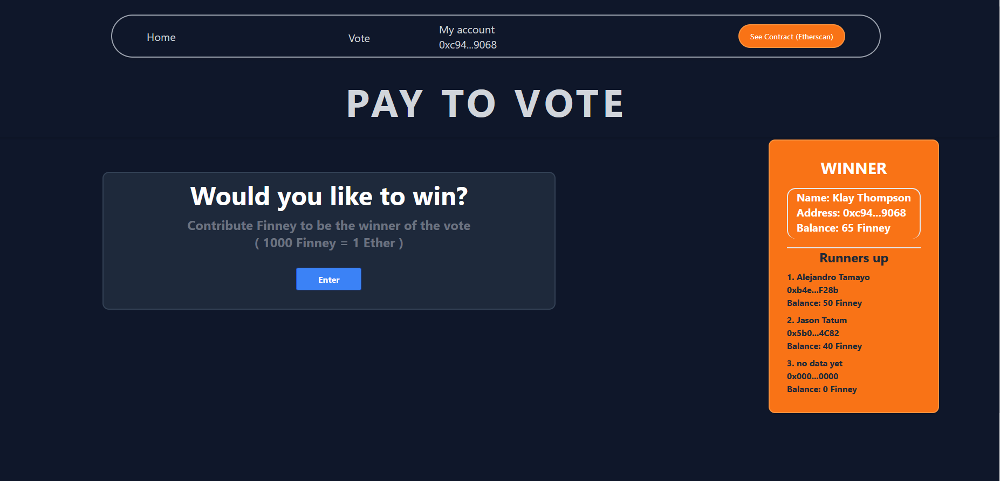

# Pay-to-Vote-Platform
Dapp where users can contribute ropsten eth to try to be the winner of a voting contest at the current time. At any given time, the current winner is the user who has paid the most ropsten eth. Users can contribute multiple times and their vote at any given time is the total of all of their contributions.



## How it works?

Using Infura provider, the front end connects with the Ropsten test Ethereum Network, allowing users to send ether to the contract to be the winner of the vote.
- In this app you are able to see the current winners, , your own account details (Address, name, balance). You can set your name so it´s linked to your address and also check the transactions you have done with a link to etherscan info.  

### How to use it? 

In order to use the app you must have a Metamask account with ether on Ropsten test network 
http://www.herongyang.com/Ethereum/MetaMask-Extension-Add-Ropsten-Test-Network.html
 
### Dependencies

This project used the following technologies: 

- React + Next.js for the frontend [React Tutorial](https://reactjs.org/tutorial/tutorial.html) - [Next tutorial](https://nextjs.org/learn/basics/create-nextjs-app)
- [Tailwinds CSS](https://tailwindcss.com/) for styling
- Express for API endpoints
    - [Express “hello world” example](https://expressjs.com/en/starter/hello-world.html)
- MongoDB for data storage
    - [Usage examples](https://www.mongodb.com/docs/drivers/node/current/usage-examples/) — categorized by type of operation
- Web3.js, Ethers.js, and [useDapp](https://usedapp-docs.netlify.app/docs) for Web3 integration
- [yup](https://github.com/jquense/yup) for Javascript data validation
- [mongo-express](https://github.com/mongo-express/mongo-express) for admin database viewing
- Nginx to serve everything over SSL
- Docker & docker-compose for environment management
- Python 3 for tooling scripts (local run, deployment, test kickoffs)
- [Mocha](https://mochajs.org/) & [Puppeteer](https://github.com/puppeteer/puppeteer) for automated testing
- Solidity for smart contracts
    - [Solidity by example](https://docs.soliditylang.org/en/latest/solidity-by-example.html)
- [Hardhat](https://hardhat.org/) for smart contract deployments
    - [Hardhat - getting started](https://hardhat.org/getting-started/)

### Project Building sequence
```
 1. Smart Contract: Solidity - test- deployment
 2. Proyect infra - Web3, contract instance, Docker setup.
 3. Next Pages implementation: web3 functions, fetching and storing data, MongoDB, API, error handling, etc.
 4. Tailwinds CSS styling
 5. Bugs & Errors fixing
 6. Deployment

